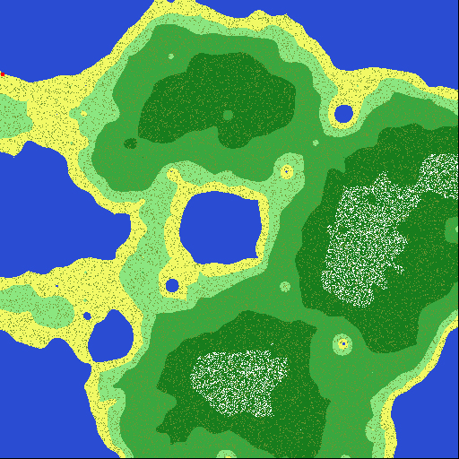
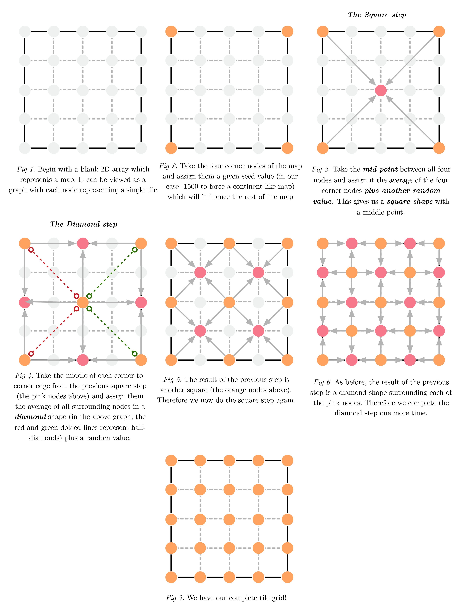

# An Overview of Procedural 2D Map Generation
## With Pascal & SwinGame

Very broadly speaking, in game development there are two primary ways to generate content for a project. The most common and controllable way is to make each part by hand - in our case we'll be referring to a 2D tile map as our content.

For small maps this isn't a problem; it's very straight-forward to declare each tile as an element of a statically-sized 2D array (we'll go into how this is done later) and just draw those tiles to the screen, perhaps also drawing different sprites on top of each tile for NPC's or the player. But what happens as our map grows in size? As it goes from a 32x32 map to a 256x256 sized map, or even larger? Even if we've created a system for writing our maps out as text files to be read in, already saving lots of time, this can very quickly become time-consuming. This is a valid way of generating content, in fact the developers on CD Projekt Red's The Witcher 3: Wild Hunt did just that (see [this article](http://kotaku.com/how-the-witcher-3s-developers-ensured-their-open-world-1735034176), it's a pretty amazing feat). However, we don't have the resources or manpower of CD Projekt Red, so what's the solution?

**Procedural Generation algorithms are the solution**

Games such as Minecraft, Dwarf Fortress, and the upcoming No Mans Sky all make use of procedural generation to generate enormous, beautiful, but seemingly random worlds. We say *seemingly* random because, aside from the fact that computers can only produce *pseudo*-random numbers, these algorithms are designed so that, with the same starting point, it will produce the same result.

#### "So then where do we start?"

Good question. Many games, such as in indie title [Dwarf Corp.](http://www.gamasutra.com/blogs/MattKlingensmith/20130811/198049/How_we_Generate_Terrain_in_DwarfCorp.php), begin by simulating tectonic plate activity (which is how terrain forms in the real world), but we're going to go a different route and start by generating a realistic height map, a 2D array of elements that hold a generated elevation value, that we'll use to base the rest of our map off.

## Diamonds & Squares

We could design an algorithm from scratch to generate our heightmap but that would take a long time and the result probably wouldn't be very effective, so we're going to borrow a very well-known and academically sound one called **Random Midpoint Displacement** (Fournier, Alain et. al. 1982), also known as **the Diamond-Square Algorithm**. At its core, the purpose of this algorithm is to generate pseudo-random noise in a desirable pattern, i.e. one that resembles a realistic spread of terrain height values. Each point of noise is stored in a data structure (in our case, a 2D array) and holds a single value - a number representing its elevation. The result is something like this:

The basic concept behind Diamond-Square can be summed like so:
* Take an empty grid which must be of size $2^{n}+1$ in order to work. Then assign the corners a *seed* value, a number that all other calculations are based off. This means that with the same seed, we should get the exact same result.
* **The Sqaure Step** - Take the grids four corners, average their total, find their mid point and assign that point the average plus a random value.
* **The Diamond Step** - Given the previous step, we now have a diamond shape surrounding a new mid point. Take the average of all points in the diamond and assign the new midpoint that value plus a random amount.
* Iterate until the next step in the process is smaller than zero

This process can be best visualized using graphs, seen below.

# Reference List
FOURNIER, A., FUSSELL, D., CARPENTER, L. & FOLEY, J. 1982. *Computer Rendering of Stochastic Models*. Communications of the ACM, 25, 371-384.
